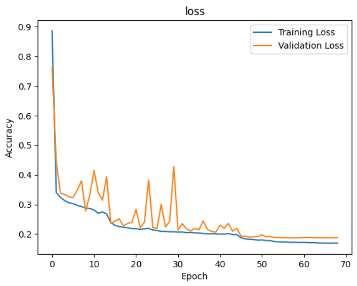
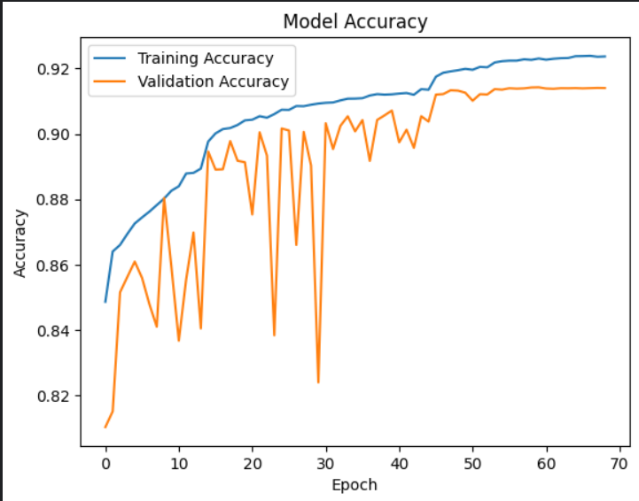

# Crater detection model

This is a project , for the Bharatiya Antarishk Hackathon organized by ISRO (Indian Space Research Organization). You can find the problem statement [here](https://isro.hack2skill.com/2024/) as _"Automatic detection of craters & boulders from Orbiter High Resolution Camera(OHRC) images using AI/ML techniques"_


## Table of Contents
- [Dataset](#dataset)
- [Architectural Components](#architectural-components)
- [Architecture](#architecture)
  - [1. Encoder Path (Contraction Phase)](#1-encoder-path-contraction-phase)
  - [2. Bottleneck (Pyramid Pooling Block)](#2-bottleneck-pyramid-pooling-block)
  - [3. Decoder Path (Expansion Phase)](#3-decoder-path-expansion-phase)
  - [4. Output Layer](#4-output-layer)
  - [5. Model Compilation](#5-model-compilation)
- [Installation](#installation)
- [Results](#results)
- [Contributing](#contributing)
- [License](#license)

## Dataset

LROC WAC images have been used in the training of the model. These images are crucial for ensuring the model's ability to segment lunar surface features accurately.

I have used the labeled images of the [images](#) (Note: Replace the link with the actual dataset link).

## The Model

The model has a complex implementation of the U-Net model for image segmentation. It is enhanced with several advanced architectural components, including Pyramid Pooling, Attention, and Squeeze-and-Excitation blocks, to improve performance in complex segmentation tasks.

### Architectural Components

- **Pyramid Pooling Block**  
  The Pyramid Pooling Block is designed to capture contextual information at multiple scales by applying pooling operations of different bin sizes to the input feature map. By reducing the feature map to various fixed sizes (e.g., 1x1, 2x2, 3x3, 6x6), the block creates a set of feature maps that represent global context at different levels of detail. These feature maps are then upsampled to match the original feature map size and concatenated along the channel dimension. This process allows the model to effectively incorporate both global and local context, improving its ability to perform accurate image segmentation across varying scales of objects and features within the image.

- **Attention Block**  
  The Attention Block is designed to focus on relevant features by computing an attention map that scales the input feature map. This helps the model attend to important regions in the image.

- **Squeeze-and-Excitation Block**  
  The Squeeze-and-Excitation Block adaptively recalibrates channel-wise feature responses by explicitly modeling interdependencies between channels, thus enhancing the representational power of the network.

- **Residual Block**  
  The Residual Block is used throughout the encoder and decoder paths, incorporating Batch Normalization, ReLU activations, and optional Squeeze-and-Excitation blocks to improve gradient flow and generalization.

# U-Net Model

## Overview

This repository contains the implementation of an advanced U-Net model designed for precise image segmentation tasks. The model utilizes a symmetric encoder-decoder architecture with several advanced components to enhance performance in complex segmentation tasks.

## Architecture

The U-Net model is composed of two main paths: the encoder (contraction path) and the decoder (expansion path), connected by skip connections.

### 1. Encoder Path (Contraction Phase)

- **Residual Blocks (ResBlocks):**
  - **Convolutional Layers:** Extract features from the input through convolution operations.
  - **Batch Normalization:** Stabilizes the learning process and speeds up convergence.
  - **ReLU Activation:** Introduces non-linearity to the model.
  - **Squeeze-and-Excitation (SE) Block:** Enhances feature representation by recalibrating channel-wise features to focus on the most informative parts.
  - **Max Pooling:** Reduces the spatial dimensions of feature maps, capturing hierarchical features and reducing computational load.
  
- **Dropout:** Applied after pooling to mitigate overfitting by randomly dropping a fraction of neurons during training.

**Workflow:**
- The input image passes through multiple ResBlocks, each reducing spatial dimensions and increasing feature depth.
- Max pooling operations progressively downsample the feature maps.
- Dropout is applied to improve model generalization.

### 2. Bottleneck (Pyramid Pooling Block)

- **Pyramid Pooling Block (PPB):** Aggregates multi-scale contextual information by:
  - Applying pooling operations with different bin sizes (e.g., 1x1, 2x2, 3x3, 6x6).
  - Using convolutional layers to reduce channel dimensions.
  - Upsampling and concatenating pooled features with the original feature map.

**Workflow:**
- Multi-scale pooling operations are performed on the feature maps.
- The pooled feature maps are upsampled and concatenated with the original feature maps.
- This process enhances the model’s ability to understand both global and local contexts.

### 3. Decoder Path (Expansion Phase)

- **UpSampling Layers:** Increase the spatial dimensions of feature maps to restore the original resolution of the image.
- **Attention Blocks:** Applied after upsampling to highlight relevant features by weighting the importance of different regions.
- **Skip Connections:** Combine upsampled features with corresponding high-resolution features from the encoder, preserving detailed spatial information.
- **Residual Blocks (ResBlocks):** Further refine the concatenated features to improve segmentation accuracy.

**Workflow:**
- Features are upsampled to match the original image dimensions.
- Attention mechanisms focus on significant features.
- Skip connections integrate high-resolution features from the encoder.
- Additional ResBlocks refine the combined features for accurate segmentation.

### 4. Output Layer

- **Final Convolutional Layer:** A 1x1 convolutional layer with a sigmoid activation function generates the binary segmentation map, where each pixel represents the probability of belonging to the target class.

**Workflow:**
- The final feature map is converted into a binary segmentation map, providing pixel-wise class probabilities.

### 5. Model Compilation

- **Optimizer:** AdamW, which combines Adam optimization with weight decay for improved generalization.
- **Loss Function:** Binary cross-entropy, suitable for binary segmentation tasks.
- **Metric:** Accuracy, used to evaluate the model’s performance during training.

## Installation

To install the dependencies, run the following command:

```
pip install -r requirements.txt

```

## Results

Here is the model performance on test data:


the loss vs epoch trend is :


The accuracy vs epoch trend :



